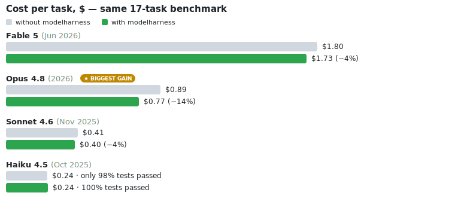

# modelharness

**Make every model cheaper or better. Measured on four Claude models — none got worse.**


**What it actually is:** a zero-config Claude Code plugin. On every session start it injects a ≈910-token behavioral core — six working practices distilled from how Fable 5 was trained to operate — plus three on-demand skills and a fresh-context verifier agent. No commands to learn; the model just starts working differently:

| | |
|---|---|
| ✅ **Grounded progress** — only claims backed by a tool result; "tests fail" said plainly | ⚡ **Act, don't overplan** — enough information means act, not narrate options |
| 🎯 **Autonomy calibration** — decides minor things itself, asks only on scope or destructive actions | 🔍 **Self-verification loops** — a checkable definition of done, real checks on a cadence, a fresh-context verifier before "done" |
| 🔀 **Delegation triggers** — explicit rules for when to fan work out to subagents | 📝 **Cross-session memory** — writes lessons and plans to files, so the next session can pick up the work |

## What the 17 tasks test

| | | |
|---|---|---|
| 🐛 **Bug hunts** <sub>4 tasks · 96 runs</sub><br>Find and fix planted defects: TTL cache, CSV quoting, rate limiter, date rollover | ✨ **Features from spec** <sub>4 tasks · 96 runs</sub><br>Build to a written spec: retry backoff, config merging, cursor pagination, slugify | ♻️ **Refactors** <sub>2 tasks · 48 runs</sub><br>Restructure code with zero behavior change, verified structurally |
| 🧠 **Long-horizon builds** <sub>2 tasks · 48 runs</sub><br>Multi-stage pipelines where later steps depend on earlier decisions | 🧩 **Spec-dense traps** <sub>3 tasks · 72 runs</sub><br>18+ interacting rules (discount engine, mini-interpreter) that punish shallow reading | 🔁 **Session handoffs** <sub>2 tasks · 48 runs</sub><br>A fresh session must finish another session's work — memory is the only bridge |

17 tasks × 3 attempts × 8 configurations = **408 runs**. Grading is hidden and binary: test suites the agent never sees decide pass/fail. No LLM judge. Every task ships with a reference solution proving it solvable.

## The results



### The numbers, exactly

Same 17 tasks, 3 runs per configuration. Higher pass rate and lower cost/time are better. 🟢 = better with modelharness, 🔴 = worse (explained in the last row).

<table>
  <tr>
    <th rowspan="2" align="left">What we measured</th>
    <th colspan="2">Fable 5</th>
    <th colspan="2">Opus 4.8 ⭐ <sub>biggest gain</sub></th>
    <th colspan="2">Sonnet 4.6</th>
    <th colspan="2">Haiku 4.5</th>
  </tr>
  <tr>
    <th><sub>plain model</sub></th><th><sub>+ modelharness</sub></th>
    <th><sub>plain model</sub></th><th><sub>+ modelharness</sub></th>
    <th><sub>plain model</sub></th><th><sub>+ modelharness</sub></th>
    <th><sub>plain model</sub></th><th><sub>+ modelharness</sub></th>
  </tr>
  <tr>
    <td align="left"><b>Tasks completed successfully</b></td>
    <td align="center">100%</td><td align="center">100%</td>
    <td align="center">100%</td><td align="center">100%</td>
    <td align="center">100%</td><td align="center">100%</td>
    <td align="center">🔴 98%</td><td align="center">🟢 <b>100%</b></td>
  </tr>
  <tr>
    <td align="left"><b>Average cost per task</b></td>
    <td align="center">$1.80</td><td align="center">🟢 <b>$1.73</b></td>
    <td align="center">$0.89</td><td align="center">🟢 <b>$0.77</b></td>
    <td align="center">$0.41</td><td align="center">🟢 <b>$0.40</b></td>
    <td align="center">$0.24</td><td align="center">$0.24</td>
  </tr>
  <tr>
    <td align="left"><sub>· bug hunts</sub></td>
    <td align="center"><sub>$1.30</sub></td><td align="center"><sub>🟢 $1.26</sub></td>
    <td align="center"><sub>$0.63</sub></td><td align="center"><sub>🟢 $0.55</sub></td>
    <td align="center"><sub>$0.26</sub></td><td align="center"><sub>🟢 $0.24</sub></td>
    <td align="center"><sub>$0.16</sub></td><td align="center"><sub>🟢 $0.13</sub></td>
  </tr>
  <tr>
    <td align="left"><sub>· features from spec</sub></td>
    <td align="center"><sub>$1.44</sub></td><td align="center"><sub>🔴 $1.49</sub></td>
    <td align="center"><sub>$0.76</sub></td><td align="center"><sub>🟢 $0.60</sub></td>
    <td align="center"><sub>$0.34</sub></td><td align="center"><sub>🟢 $0.32</sub></td>
    <td align="center"><sub>$0.18</sub></td><td align="center"><sub>🟢 $0.16</sub></td>
  </tr>
  <tr>
    <td align="left"><sub>· refactors</sub></td>
    <td align="center"><sub>$0.91</sub></td><td align="center"><sub>$0.91</sub></td>
    <td align="center"><sub>$0.51</sub></td><td align="center"><sub>$0.51</sub></td>
    <td align="center"><sub>$0.21</sub></td><td align="center"><sub>🔴 $0.22</sub></td>
    <td align="center"><sub>$0.11</sub></td><td align="center"><sub>$0.11</sub></td>
  </tr>
  <tr>
    <td align="left"><sub>· long-horizon</sub></td>
    <td align="center"><sub>$1.90</sub></td><td align="center"><sub>🟢 $1.28</sub></td>
    <td align="center"><sub>$0.71</sub></td><td align="center"><sub>🟢 $0.60</sub></td>
    <td align="center"><sub>$0.35</sub></td><td align="center"><sub>🟢 $0.26</sub></td>
    <td align="center"><sub>$0.13</sub></td><td align="center"><sub>🔴 $0.14</sub></td>
  </tr>
  <tr>
    <td align="left"><sub>· spec-dense traps</sub></td>
    <td align="center"><sub>$2.13</sub></td><td align="center"><sub>🔴 $2.21</sub></td>
    <td align="center"><sub>$1.13</sub></td><td align="center"><sub>🟢 $1.02</sub></td>
    <td align="center"><sub>$0.65</sub></td><td align="center"><sub>🔴 $0.74</sub></td>
    <td align="center"><sub>$0.40</sub></td><td align="center"><sub>🔴 $0.50</sub></td>
  </tr>
  <tr>
    <td align="left"><sub>· session handoffs</sub></td>
    <td align="center"><sub>$3.80</sub></td><td align="center"><sub>🟢 $3.74</sub></td>
    <td align="center"><sub>$1.92</sub></td><td align="center"><sub>🟢 $1.59</sub></td>
    <td align="center"><sub>$0.79</sub></td><td align="center"><sub>🟢 $0.66</sub></td>
    <td align="center"><sub>$0.52</sub></td><td align="center"><sub>🟢 $0.48</sub></td>
  </tr>
  <tr>
    <td align="left"><b>Average time per task, seconds</b></td>
    <td align="center">130</td><td align="center">🟢 <b>118</b></td>
    <td align="center">114</td><td align="center">🟢 <b>96</b></td>
    <td align="center">123</td><td align="center">🟢 <b>118</b></td>
    <td align="center">104</td><td align="center">🟢 <b>96</b></td>
  </tr>
  <tr>
    <td align="left"><b>What the harness improved, on average</b></td>
    <td colspan="2" align="left"><sub>🟢 <b>3.5% cheaper, 9% faster</b> on average — even against the model these patterns came from. Pays a little extra on spec-dense tasks as verification insurance; wins it back big on long-horizon builds (−33%).</sub></td>
    <td colspan="2" align="left"><sub>🟢 <b>14% cheaper, 16% faster</b> on average — the biggest win of all four. Cheaper or equal in every single category; nothing traded away.</sub></td>
    <td colspan="2" align="left"><sub>🟢 <b>4% cheaper and 4% faster</b> on average. Pays +14% on spec-dense tasks for the same verification insurance — repaid by −26% on long-horizon and −17% on handoffs.</sub></td>
    <td colspan="2" align="left"><sub>🟢 <b>98% → 100% tasks solved.</b> The extra spend on spec-dense tasks (+25%) is the self-checking that caught and fixed its own mistakes — and it still finished the benchmark 7.5% faster at the same average price.</sub></td>
  </tr>
</table>

> **The bottom line.** modelharness packages the same working practices Fable 5 was trained on. The practices land hardest on **Opus 4.8** — the flagship model available on every subscription — at **−14% cost / −16% time**, and that win is statistically significant (see below). Even Fable 5, competing against itself, runs significantly faster. On smaller models the average hides a trade: Haiku saves up to 19% on routine bugfixes but spends more on spec-dense tasks — extra verification work that is exactly what lifted its pass rate from 98% to **100%**. Cheaper where it can be, more careful where it must be — and never significantly worse on any model.

### How confident are we?

Averages can hide noise, so we ran the honest test: pair each model's plain vs +modelharness runs on the **same task** (3 reps averaged), take the per-task percentage delta, and put a 95% confidence interval around the mean across all 17 tasks. A CI that clears zero is a real effect; one that straddles zero is within run-to-run noise. Regenerate with `python3 bench/stats.py`.

| Model | Cost Δ (95% CI) | Time Δ (95% CI) | Tasks cheaper |
|---|---|---|---|
| **Opus 4.8** | **−12.0%** [−17.3, −6.7] · significant | **−16.5%** [−25.3, −7.7] · significant | 15 / 17 |
| Fable 5 | −3.2% [−10.6, +4.2] · within noise | **−11.4%** [−20.1, −2.8] · significant | 8 / 17 |
| Sonnet 4.6 | −4.0% [−11.3, +3.3] · within noise | −7.8% [−15.7, +0.0] · within noise | 10 / 17 |
| Haiku 4.5 | +0.3% [−8.7, +9.3] · within noise | −4.5% [−17.6, +8.6] · within noise | 9 / 17 |

What this means, stated plainly: the harness delivers a **statistically significant** cost-and-time reduction on **Opus 4.8** — the model most people run on a subscription — and a significant speed-up on Fable 5. For Sonnet 4.6 and Haiku 4.5 the cost and time changes are **within noise**: not a reliable saving, but never a reliable loss either. Quality is not a sampled average — it is an exact binary count: **407 of 408 runs passed**, and the one failure (bare Haiku 4.5 on a session-handoff task) is fixed 3/3 by the harness. So the defensible claim is narrow and true: **Opus gets meaningfully cheaper and faster, every model gets a memory-driven reliability floor, and none is significantly worse.**

## ⚡ Install — 30 seconds, zero config

```
/plugin marketplace add vitaliikapliuk/modelharness
/plugin install modelharness@modelharness
```

Restart Claude Code — active in every session, on whatever model you run.

## Why this exists

Claude Fable 5 left subscription plans on June 23, 2026 — the most capable model became API-only, and most subscribers went back to Opus, Sonnet, or Haiku. That raised a question worth measuring rather than debating: how much of a frontier model's edge is *weights*, and how much is *working practices* — the documented behaviors like grounded progress reporting, self-verification, and file-based memory that Anthropic describes in its own migration guides?

So we distilled those practices into a plugin and built a benchmark to find out. The answer surprised us in both directions: on self-contained coding tasks the practices made **every** model cheaper or better — including Fable 5 itself — while raw correctness at benchmark scale turned out not to separate the models at all. The harness, not the weights, was the measurable difference.

## How it works

A SessionStart hook injects a behavioral core (**≈910 tokens — your entire context tax**, measured, not estimated) implementing six patterns from Anthropic's official Fable 5 migration guide:

| Pattern | Source |
|---|---|
| Grounded progress claims | Fable 5 migration guide → "Ground progress claims on long runs" |
| Act, don't overplan | Fable 5 migration guide → "Longer turns by default" |
| Autonomy calibration | Opus 4.8 notes → "More deliberate — asks more often" |
| Self-verification loops | Fable 5 guide → "Make self-verification explicit" |
| Delegation triggers | Opus 4.8 notes → "Under-utilization of subagents" |
| Memory surface | Fable 5 guide → "Give it a memory surface" |

Plus three on-demand skills (`verification-loop`, `memory-discipline`, `delegation-triggers`), a fresh-context `verifier` agent, and three optional power-user commands (`/modelharness:goal`, `/modelharness:verify`, `/modelharness:retro`).

The hook only appends context — it never intercepts or blocks anything. Tested alongside [superpowers](https://github.com/obra/superpowers).

## What this can NOT do

- Raise raw reasoning ability or one-shot intelligence on hard problems.
- Reproduce Fable 5's tokenizer or always-on protected thinking.
- Separate the top models on correctness at benchmark scale: every configuration with modelharness scored 100%. Real differences in multi-hour messy sessions exist but are unmeasured here — those are Anthropic's documented claims, not our data.

**Grading integrity:** every failure was hand-audited; two grader fixes were made during capture (from-import delegation; `__all__` dunder exemption), both in the models' favor — each one documented with its diff and rationale in [`bench/GRADING.md`](bench/GRADING.md).

## Reproduce it

```
bench/run.sh --config bare --reps 3        # any of 8 configs
python3 bench/report.py                    # category table
python3 bench/lift.py                      # per-model harness lift
python3 bench/stats.py                     # paired per-task deltas with 95% confidence intervals
python3 bench/chart.py                     # regenerate the hero chart from the CSV
```

Full 8-config capture measured ≈ $330 API-equivalent (per-config costs in [`bench/README.md`](bench/README.md)). Hidden binary grading; `bench/scripts/selfcheck.sh --all` proves every task fails untouched and passes on its reference solution.

## Contributing

The most valuable PR: a task where a bare model demonstrably fails and modelharness passes. The two-phase session-handoff format is in [`bench/TASK_FORMAT.md`](bench/TASK_FORMAT.md). See [CONTRIBUTING.md](CONTRIBUTING.md).

## License

MIT
